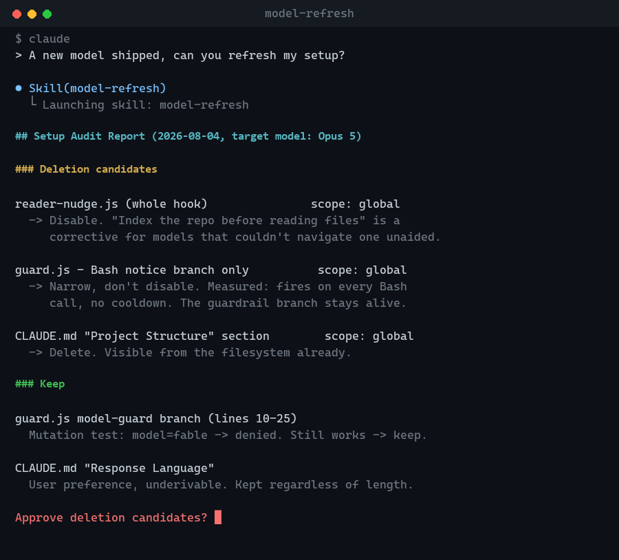

# model-refresh

[](LICENSE)

A [Claude Code](https://claude.com/claude-code) skill that audits your entire setup — plugins, hooks, agents, skills, MCP connectors, and CLAUDE.md — against one question:

> **Can the model figure this out on its own?**

If yes, that instruction was a corrective device for an older model generation, and today it's pure context cost and a source of behavioral distortion. This standard comes from advice by [Boris Cherny](https://github.com/bcherny), creator of Claude Code — a setup is always tuned for the model that's two generations behind whatever you're running now. `/model-refresh` is the workflow for re-applying it every time a new model ships.


*Turn sprawling configuration into a setup tuned for today’s models.*



*A real Phase 0–3 run captured against the synthetic fixture in [`evals/fixture-home`](evals/fixture-home) — nothing here touches a real `~/.claude`. Full report excerpted for length; see [`evals/evals.json`](evals/evals.json) id 1 to reproduce it yourself.*

## Why this exists

`/doctor` checks configuration correctness. It doesn't tell you that a plugin is injecting a paragraph into every prompt for a problem the current model no longer has, that a hook's guardrail is about to die along with its annoying notice if you disable the whole script, or that a skill you installed for one project is now loaded — and silently competing for the model's attention — in every project you open.

`model-refresh` covers two layers `/doctor` doesn't:

- **Providers** — plugins, hooks, agent descriptions, the skill list, MCP connectors: the *sources* of instructions, not their content.
- **Content** — a line-by-line pass over global and project `CLAUDE.md`, judged by the same standard, with every deletion proposal shown as a quoted line and gated behind your explicit approval.

## What it actually does

Five phases, with a hard approval gate before anything changes:

1. **Load prior audits** — diffs against the last run instead of starting cold every time.
2. **Concurrent-session preflight** — checks file mtimes so two sessions editing `~/.claude/CLAUDE.md` at once don't silently clobber each other.
3. **Inventory** — collects plugins, hooks, agents, skills, MCP connectors, and `/context`/`/usage` data.
4. **Judgment** — classifies every item as *deletion candidate*, *keep*, or *needs your judgment*, against evidence, not impression — see [Judgment rules](references/audit-rules.md).
5. **Completion-check expiry review** — the check most people forget: your test suites, QA gates, and pass/fail bars expire too. Mutation-tests them to prove it rather than guessing.
6. **Report → approval → delegated apply → runtime verification → record.** Nothing gets touched before you say so, per group. Runtime-affecting changes (MCP, plugins, hooks) are confirmed with an actual headless init event — not just a file re-read — because [a file can say one thing while the runtime reads another](references/runtime-verify.md).

Optional **deep mode** (`/model-refresh deep`) goes one step further: run your real tasks with the whole setup disabled in safe mode, and if the results are identical, that's empirical proof the setup was dead weight — not just a theory.

## Install

Copy this skill into your Claude Code skills directory:

```bash
# user-scope (available in every project)
git clone https://github.com/gupilleveldesigner/model-refresh ~/.claude/skills/model-refresh

# or project-scope (this project only)
git clone https://github.com/gupilleveldesigner/model-refresh .claude/skills/model-refresh
```

Then just talk to it — no separate install step beyond the file copy.

## Usage

```
/model-refresh          # standard audit
/model-refresh deep     # + safe-mode baseline comparison
```

It also triggers on natural language: "clean up my setup," "why does my context feel bloated," "I ran /doctor and nothing changed," "a hook keeps injecting something weird," "there are too many skills unrelated to this project," "a connector says it's connected but doesn't work," and similar. For a one-line config change (add a permission, set an env var), it correctly stays out of the way — that's a job for a plain config edit, not a full audit.

## Design notes

- **Safety-first**: every change is reversible — disable over delete, backup before modify, and a re-check of file mtimes immediately before applying in case another session touched the same files mid-audit.
- **Evidence over impression**: a frequency claim like "this hook fires on every message" only makes it into the report if it's backed by reading the hook body, a throttle/state file, or an actual count from the transcript. Guessing wrong here has cost real users a working guardrail alongside the noise they meant to silence — see [`references/audit-rules.md`](references/audit-rules.md) for the incident.
- **Scope discipline**: "unused in this project" is not "safe to disable globally." The rules force a check across other projects before anything gets turned off outside project scope.
- **Only a human can approve**: if this skill somehow runs inside an autonomous loop or another agent's context with nobody around to approve, it stops at the report and refuses to apply anything.

## Repo layout

```
SKILL.md                        entry point Claude Code reads
references/
  audit-rules.md                the 3-question judgment standard + category-specific rules
  apply-protocol.md             Phase 4 delegated-agent prompt template + safety rules
  runtime-verify.md             headless init-event verification procedure
  eval-expiry.md                Phase 2b completion-check expiry review
  deep-baseline.md              deep-mode safe-mode baseline comparison
evals/                          trigger + task fixtures for measuring this skill's own quality
                                 (excluded from the packaged skill — see evals/README.md)
```

## Evals

`evals/` ships a synthetic fixture home (`evals/fixture-home/`) with five deliberately planted defects — a duplicate project key, a hook mixing a notice with a real guardrail, project-scoped skills that shouldn't be disabled globally, a hook with a cooldown that a naive report would call "every time," and a rejected proposal that shouldn't be re-raised. Nothing in the fixtures is real user data. See [`evals/README.md`](evals/README.md) for how to run them and for a documented set of Windows-specific harness bugs (and their fixes) if you're evaluating on that platform.

## License

[MIT](LICENSE)
